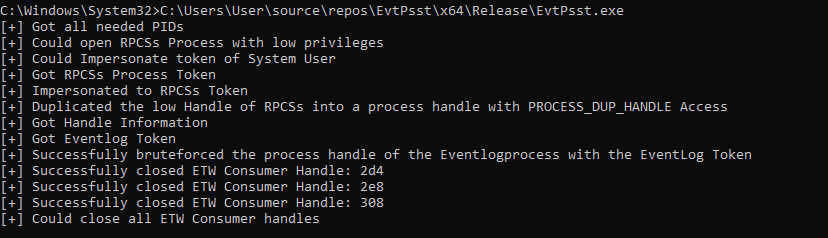

# EvtPsst

This is a tool that allows you to tamper with the eventlog process without an OpenProcess Call to the EventLog process itself.

This tool uses exposed Handles of the RPCSs process to reconstruct a full process handle to the EventLog process in the UserMode.

## Usage

Build the tool with Visual Studio. (Tested on Windows 11 22H2 OS Build 22621.2283).

EvtPsst will automaticly resolve all needed processes and works automaticly.
Once EvtPsst has an process handle to the Eventlog Process it tampers it with the closing of the ETW Consumer Handles.

Start the tool with administrator rights.

## How does it work?

RPCSs has many Process Handles exposed with SYNCHRONIZE access to different processes as well as token handles for many different processes.

- EvtPsst opens a handle to the RPCSs svchost.exe process with a low access mask of PROCESS_QUERY_LIMITED_INFORMATION.
- Impersonate System in order to steal the token of the RPCss Eventlog process
- Impersonate RPCSs token in order elevate the handle to higher access rights
- Enumerate the EventLog Process token in the handles of the RPCSs process
- Bruteforce a process handle with higher access than SYNCHRONIZE to the Eventlog Process with the EventLog process token
- Profit, (Closing the ETW Consumer Handles is just implemented as POC)

## Detection Notes

No Process Access Events can be observed to the EventLog svchost.exe process.
A change of the tokenuser for one process from normal Adminrights to SYSTEM and NETWORK SERVICE and a repeated change between NETWORK SERVICE and LOCAL SERVICE could be an idea to try to detect this tool.

No Se Debug Privilege is used.

If you have the possibility to detect it via an kernel callback, you can try to detect it with the OB_OPERATION_HANDLE_DUPLICATE Callback.
https://learn.microsoft.com/en-us/windows-hardware/drivers/ddi/wdm/ns-wdm-_ob_pre_operation_information

## Note

A blogpost will follow up the next few days, describing the technique behind the tool and the successes and fails during the development of this tool as well with a detailed explanation why which step works.

## References
* [HandleKatz + Disclaimer](https://github.com/codewhitesec/HandleKatz) Implementation by [@thefLinkk](https://twitter.com/thefLinkk) and disclaimer by [@codewhitesec](https://twitter.com/codewhitesec)
* [WMI Get Service POC](https://github.com/thefLink/C-To-Shellcode-Examples/tree/master/WMI_get_pid_service_evt) by [@thefLinkk](https://twitter.com/thefLinkk)
